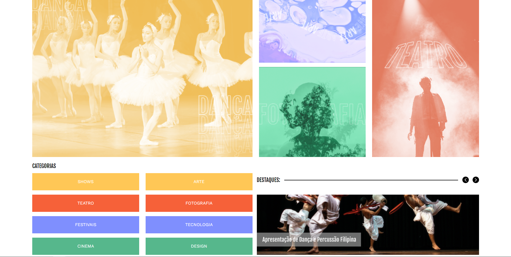

## Visão Geral

### O projeto

- Criar um Landing Page responsiva de eventos

### Screenshot

### Links

- Live Site URL: [Culturama](https://culturama-mu-kohl.vercel.app/)

## Meu processo

### Criado com

- HTML
- CSS

### O que eu aprendi

- Aprendi a utilizar mais do GRID
- Aprendi a utilizar mais do Flexbox

## Autor

- GitHub - [João Metzdorf](https://github.com/joaometzdorf)
